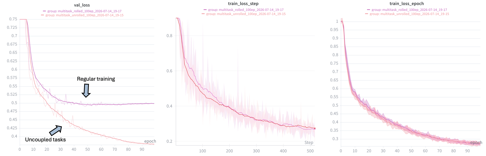

# Model Report — OpenADMET PXR Blind Challenge 
**Track:** Activity Prediction (pEC50)  
**Date:** 30 June 2026     
**Updated:** 30 August 2026

*First draft of model report: more to come!*

## 1. Overview

Our submission is based on Chemprop v2, a directed message-passing neural network (D-MPNN). We took a multi-task approach and trained a shared encoder to simultaneously predict multiple PXR-related endpoints. The intuition is that the auxiliary tasks provide regularising signal that helps the model learn better molecular representations for the primary pEC50 prediction task via a feed forward nerual network.

## 2. Model Architecture

The model uses a bond message-passing encoder with norm aggregation to produce a fixed-size molecular embedding. A single multi-output FFN head is attached to this shared encoder and predicts all tasks simultaneously. The loss function is MSE with equal weighting across all tasks.

## 3. Training Data

We used all available OpenADMET assay data as training tasks:

- **oa_drc_pec50** — primary 8-point dose-response pEC50 values (the challenge target)
- **oa_sc_log2fc_8uM, oa_sc_log2fc_33uM, oa_sc_log2fc_99uM** — single-concentration log2 fold-change from the primary screen, at three concentrations
- **oa_drc_emax** — maximal activation from the dose-response assay
- **oa_counter_assay_pec50, oa_counter_assay_emax** — counter-assay pEC50 and Emax, used to flag non-specific transcriptional activators
- **htchem_pec50** — yield-corrected pEC50 values from Octant's high-throughput chemistry library
- **oa_semipure_pec50** — pEC50 values from the semi-purified HTChem compounds

All nine tasks share the same molecular encoder. The model handles missing labels naturally through NaN masking, so compounds that only appear in a subset of tasks still contribute to training.

## 4. Training Procedure

Model development used 5-fold stratified scaffold cross-validation throughout. In phase 1, we used a random cross-validation split to guide model development. In phase 2, we switched to stratified scaffold split with an additional recreated phase 1 leaderboard using the unblinded analogue set 1. We found the recreaetd leaderboard to be very noisy so relied more on our 5-fold CV.  

Training used a cosine decay learning rate schedule. Compounds flagged as censored were excluded from training. Internal cross validation and recreated leaderboard metrics for MAE, RAE, R2, Spearman, and Kendall's tau were collectively used for model development decision making. 

## 5. Task uncoupling 
Training dynamics improved considerably when multitask training data was converted to long format, where each sample shown to the model was for a single task, even if multiple tasks existed for that drug. 
This allowed gradient updates to be somewhat decoupled, providing (we hypothesise) more task-specific model updates during backprop. 
We achieved a notable drop in validation loss and performance when implementing this training technique:   

  

## 6. Our submission
Our final submission was our multitask model as described above with all the OpenADMET PXR challenge data aside from htchem_pec50 and oa_semipure_pec50 (7 tasks total), it included analogue test set 1 in the training data and was trained 5-fold CV. 
We trained 3 independent replicates with different random seeds, took the best val checkpoint, and averaged the predictions across all replicates for the final submission. Our hope is that this ensemble approach reduces variance from individual training runs, which we found to be substantial given the small test set.    
  
This model achieved a rank of 60th (54th without proprietary data). 

## 7. Other model
Selecting a model at the end of the challenge proved difficult. We were choosing between 3 models to submit and unfortunately picked the worst! 
With the release of analogue test set 2, we were able to identify our best model and where it would have placed. Our best model was trained on 100% of available challenge data (9 tasks), no public data was used nor any pretraining. 
It incorporated task uncoupling and loss weighting using confidence interval data provided in by OpenADMET for many tasks. With this model, we knew that taking the final checkpoint (500 epochs) resulted in stronger performance.   
  
This model (would have) achieved a rank of 15th (10th without proprietary data).      
  
*paper to come**

